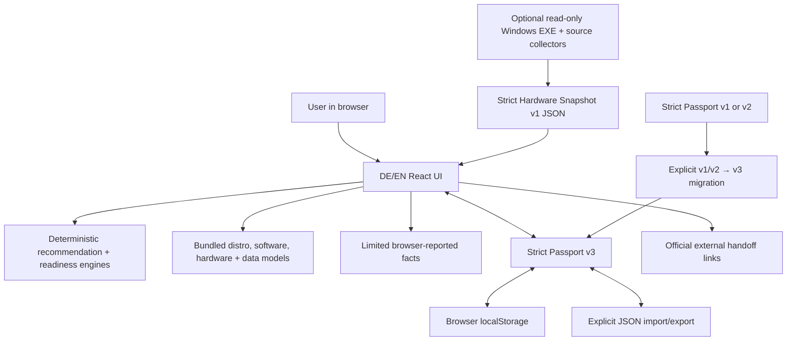

# Architecture

Last reviewed: 2026-08-13

## System shape

Linux Migration Companion is a static single-page application built with React, TypeScript, Vite, and Zod. Static hosting serves immutable HTML/CSS/JavaScript assets. There is no application API.

Only an explicit external-link handoff crosses the application origin. Collector downloads are static same-origin files. The application and collectors make no runtime data API, font, analytics, telemetry, upload, or compatibility request. The voluntary Support page is another explicit external-link boundary; it is not a payment integration and does not load third-party content until a user activates a link.

## Modules

| Area | Source | Responsibility |
|---|---|---|
| Domain | `src/domain` | Closed types, isolated defaults, Passport state |
| Curated data | `src/data` | 16 distro profiles, 90 software/workflows, 19 hardware classes, 19 data categories, 21 questions, 10 live checks |
| Recommendation | `src/engine/recommend.ts` | Pure ordinal scoring, tier caps, specialist gates, explanations, warnings |
| Software/live evidence | `src/engine/assess.ts` | Software risk/blockers and live-test status |
| Readiness | `src/engine/readiness.ts` | Explainable readiness and Windows-retention strategy; hard blockers outrank preferences |
| Data migration | `src/engine/dataMigration.ts` | Non-executing plan items and evidence completeness |
| First boot | `src/engine/firstBoot.ts` | Personalized what/why/risk/verify/back-out plan with no commands |
| Hardware Snapshot | `src/hardware` | Limited browser collection, strict untrusted JSON validation, evidence mapping |
| Windows executable | `collectors/windows-exe` | Dependency-free C#/.NET Framework 4.8 source, WinForms UI, local WMI/Win32 allowlist collection, create-new JSON output and Windows tests |
| Downloadable collectors | `public/collectors` | Built Windows executable/checksum, advanced PowerShell source and Linux Python source |
| Passport | `src/passport` | Strict v3 validation, v1/v2 migrations, size/depth controls, local persistence |
| UI | `src/components` | Ten-stage accessible migration journey plus a separated, unnumbered voluntary Support page |

## State and evidence flow

`App.tsx` owns one `MigrationPassport`. Every user change creates a new typed value, stamps `updatedAt`, and attempts to persist it. If browser storage is disabled or full, the in-memory application continues.

Recommendations, software assessment, data assessment, readiness, and First Boot steps are pure derived results. They are not stored as authoritative claims, so a newer rule set can recompute them from the recorded evidence.

Snapshot integration and live evidence are separate. An imported fact can move an otherwise `unknown` represented class to `known_fact`; it does not change `required`, compatibility, or any live result. Browser snapshots contain no device facts. A newer snapshot replaces the old snapshot and removes only stale detail-free states derived from the old one.

Live-test results update only the corresponding evidence class:

- `works` → `live_verified`;
- `issue` → `failed_test`;
- `not_applicable` → not required + `not_applicable`;
- reverting a linked live result removes only the prior live-derived state, returning to `known_fact` when the current snapshot still detects that class and otherwise to `unknown`.

A manufacturer or product name never becomes compatibility evidence. `known_fact` and `user_reported` remain unresolved for required functions until a representative live test succeeds.

## Navigation and static hosting

The active numbered section is mirrored in the `?step=` query parameter. This provides stable direct URLs, refresh behavior, and browser back/forward support without a server router. Unknown step IDs fall back to the advisor. Support is deliberately not an `AppSection`, receives no number and does not write a `?step=` value. Returning to any numbered destination closes it. Static project-subpath builds use `VITE_BASE_PATH=/linux-migration-companion/`; the favicon also respects that base.

## Deployment boundary

Pull requests run lint, strict TypeScript, web tests/build, production-dependency audit, a Windows executable build and its independent C# core tests. CodeQL analyzes JavaScript/TypeScript and C#. Pushes to `main` are the only automatic Pages deployment trigger. Work on another branch cannot deploy unless a human explicitly changes the workflow or merges it.

The approved crawler-readiness configuration exposes one canonical indexable URL: `https://www.dennishilk.com/linux-migration-companion/`. Every query-driven `?step=` state keeps its deep link while the static canonical points to that root, preventing the ten application states from becoming intended search documents. The single client-stored DE/EN surface publishes no fake localized URLs or `hreflang` pairs. This repository ships a one-URL subpath sitemap; the authoritative origin-root `robots.txt`, main sitemap and inbound site navigation remain integration responsibilities of the main website.

## Collector executable boundary

Version `0.3.0` includes a framework-dependent Windows `.exe` built from readable C# source, an advanced PowerShell reference and a Linux Python source collector. Their exact OS interfaces and fields are reviewed in [HARDWARE_SNAPSHOT.md](HARDWARE_SNAPSHOT.md). They never run inside or automatically from the web app, and the manual path remains complete.

The executable directly queries only local WMI and two small Win32 boundaries: firmware type and the Downloads known folder. A third explicit Win32 call opens that fixed folder only after the user presses **Open folder**. It requests no elevation, ships no app DLL/plugin, never interprets device data as code and has no network/update path. Build/checksum/signing details are in [WINDOWS_COLLECTOR_RELEASE.md](WINDOWS_COLLECTOR_RELEASE.md).

Any later auto-update mechanism, background service, local IPC, automatic execution, privilege request or network client would be a new security boundary requiring separate review. Enumeration must still never become a compatibility guarantee.
