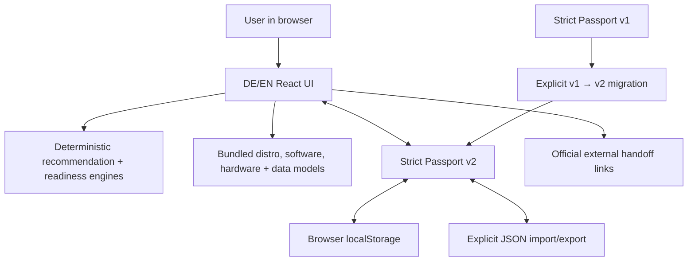

# Architecture

Last reviewed: 2026-08-11

## System shape

Linux Migration Companion is a static single-page application built with React, TypeScript, Vite, and Zod. Static hosting serves immutable HTML/CSS/JavaScript assets. There is no application API.

Only the final link handoff crosses the application origin, and only after a normal user action. The application makes no runtime data API, font, analytics, telemetry, or compatibility request.

## Modules

| Area | Source | Responsibility |
|---|---|---|
| Domain | `src/domain` | Closed types, isolated defaults, Passport state |
| Curated data | `src/data` | 11 distro profiles, 90 software/workflows, 19 hardware classes, 19 data categories, 21 questions, 10 live checks |
| Recommendation | `src/engine/recommend.ts` | Pure ordinal scoring, tier caps, specialist gates, explanations, warnings |
| Software/live evidence | `src/engine/assess.ts` | Software risk/blockers and live-test status |
| Readiness | `src/engine/readiness.ts` | Explainable readiness and Windows-retention strategy; hard blockers outrank preferences |
| Data migration | `src/engine/dataMigration.ts` | Non-executing plan items and evidence completeness |
| First boot | `src/engine/firstBoot.ts` | Personalized what/why/risk/verify/back-out plan with no commands |
| Passport | `src/passport` | Strict v2 validation, v1 migration, size/depth controls, local persistence |
| UI | `src/components` | Ten-stage accessible migration journey |

## State and evidence flow

`App.tsx` owns one `MigrationPassport`. Every user change creates a new typed value, stamps `updatedAt`, and attempts to persist it. If browser storage is disabled or full, the in-memory application continues.

Recommendations, software assessment, data assessment, readiness, and First Boot steps are pure derived results. They are not stored as authoritative claims, so a newer rule set can recompute them from the recorded evidence.

Live-test results update only the corresponding manual evidence class:

- `works` → `live_verified`;
- `issue` → `failed_test`;
- `not_applicable` → not required + `not_applicable`;
- reverting a linked live result removes only the prior live-derived state.

A manufacturer or product name never becomes compatibility evidence. `known_fact` and `user_reported` remain unresolved for required functions until a representative live test succeeds.

## Navigation and static hosting

The active section is mirrored in the `?step=` query parameter. This provides stable direct URLs, refresh behavior, and browser back/forward support without a server router. Unknown step IDs fall back to the advisor. Static project-subpath builds use `VITE_BASE_PATH=/linux-migration-companion/`; the favicon also respects that base.

## Deployment boundary

Pull requests run lint, strict TypeScript, tests, build, and a production-dependency audit. Pushes to `main` are the only automatic Pages deployment trigger. Release-candidate work on another branch cannot deploy unless a human explicitly changes the workflow or merges it.

Search indexing is an explicit separate release gate: `index.html` uses `noindex,nofollow` and `public/robots.txt` disallows crawling until Dennis approves public integration.

## Boundary for future native code

A Windows hardware companion is not part of this release candidate. If later justified, it must be a separate, signed, open-source, read-only binary with a documented field allowlist, local preview/redaction, no network client, no raw disks, and a separately reviewed threat model. The web UI must continue to work without it and must not convert enumeration into a compatibility guarantee.
