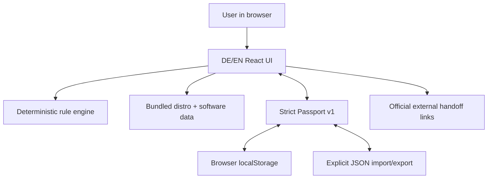

# Architecture

## System shape

Linux Migration Companion is a static single-page application built with React, TypeScript, Vite, and Zod. GitHub Pages serves immutable HTML/CSS/JavaScript assets. There is no application API.

Only the last arrow crosses the application origin, and only after a normal link action. The application makes no runtime data API, font, analytics, or telemetry request.

## Modules

| Area | Source | Responsibility |
|---|---|---|
| Domain | `src/domain` | Closed types, safe defaults, Passport state |
| Curated data | `src/data` | 11 distro profiles, 60 software workflows, 21 questions, 10 live checks |
| Decision engine | `src/engine/recommend.ts` | Pure scoring, tier caps, specialist gates, explanations, warnings |
| Evidence engine | `src/engine/assess.ts` | Software blockers and live-test readiness |
| First boot | `src/engine/firstBoot.ts` | Non-executing personalized plan |
| Passport | `src/passport` | Strict validation, size/depth controls, local persistence |
| UI | `src/components` | Seven-step accessible migration journey |

## State flow

`App.tsx` owns one `MigrationPassport`. Every user change creates a new typed value, stamps `updatedAt`, and attempts to persist it. If browser storage is disabled or full, the in-memory application continues; an explicit export remains available.

Recommendations and assessments are derived with pure functions and `useMemo`. They are not stored as authoritative facts in the Passport, so updated rules can recompute them from the evidence.

## Deployment

Pull requests run lint, strict TypeScript, tests, build, and a production-dependency audit. Pushes to `main` also build with the project Pages base path and deploy the resulting `dist` directory through the official Pages artifact flow. Workflows use minimal permissions and pinned major action versions.

## Boundary for future native code

A Windows hardware companion is not part of Alpha. If later justified, it must be a separate, signed, open-source, read-only binary with a documented field allowlist, local preview/redaction, no network client, no raw disks, and a separately reviewed threat model. The web UI must continue to work without it and must not convert enumeration into a compatibility guarantee.
